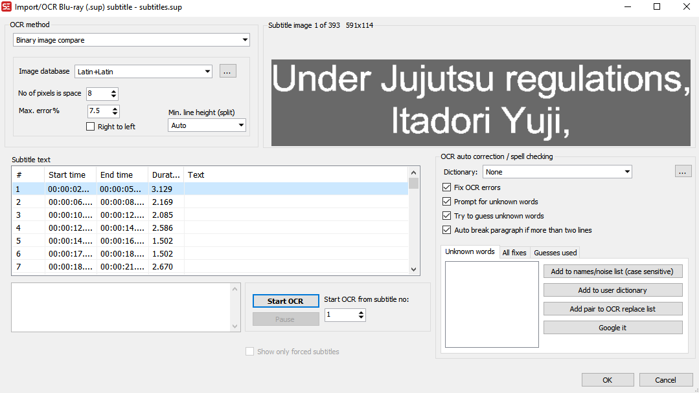

!!! warning inline end "Required Tools <br/>[ffmpeg](https://www.ffmpeg.org/download.html) and [SubtitleEdit](https://github.com/SubtitleEdit/subtitleedit/releases)"

### Extracting Image-based subtitles and converting them
This is useful for when you have a video file with embedded subtitles but they are bitmap based so you cannot use them with tools like ==[auto-sub-retimer](https://github.com/kanjieater/auto-sub-retimer)== or ==[subs2cia](https://github.com/dxing97/subs2cia)==

#### 1. Extracting
Extract the image-based subtitles from the video file into a new file called `subtitles.sup`
``` { .bash .copy }
ffmpeg -i '.\video.mkv' -map 0:s:1 -c copy subtitles.sup
```
!!! note inline end "You may need to choose a different subtitle index"
*  Here we take an input file, marked by ==-i .\video.mkv==
*  We copy the second subtitle stream (==-map 0:**s:1**==) to a new file ==subtitles.sup==

#### 2. OCR
Open up `subtitles.sup` in SubtitleEdit. 

{ width=65%, align=left}

**It should look like this**


Click `Start OCR` and fix anything it is unsure of. You can also lower the max error rate to make sure you get good subtitles at the end. 

Hit `OK` when it completes. Then click `File -> Save` to save it

<br/><br/><br/><br/><br/>

#### 3. `Optional` Remux new subtitles back into the video
This command takes the original file, copies all the original audio, video and subtitle streams, and adds the additional subtitle file you just created into a new file called `video_with_subs.mkv`
``` { .bash .copy }
ffmpeg -i '.\video.mkv' -f srt -i '.\subtitles.srt' -map 0 -c:v copy -c:a copy -c:s srt 'video_with_subs.mkv'
```


