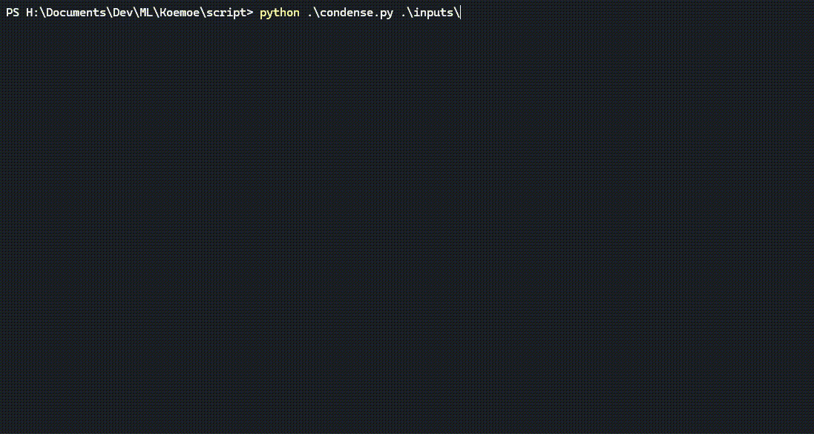

# Home
    
### Easily create audio for passive input
Condense anime audio into just the dialogue. Optionally include the OP and ED. No need to find or sync any subtitles.
!!! terminal " "
    <figure markdown="span">
        
    </figure>

## Features

* Generates condensed audio from video files without subtitle files
* Optionally include the OP and ED in the final condensed file
* Input a single video or a folder of videos
* Uses ML model based on the [YOHO paper](https://arxiv.org/abs/2109.00962) with a [convnext](https://arxiv.org/abs/2201.03545) backbone

## Planned Updates
* Automatic Model Updates on Startup
* Remove Fastai requirement for running the model
* Options to change some of the model output filtering and smoothing such as the threshold and padding values

## Caveats
* The quality of the output can vary depending on the content. I will be adding options in the future for more aggressive or less aggresive filtering. However, the quality of the model should improve over time as I expand and modify the dataset. 

## Alternatives + Other Tools
??? example "**Condensing**"
    1.
        [subs2cia](https://github.com/dxing97/subs2cia) - Condenses audio using subtitle files. I was using this before developing Koemoe.
??? example "**Subtitle Retiming**"
    1.
        [auto-sub-retimer](https://github.com/kanjieater/auto-sub-retimer)
        For retiming subtitles to videos. Very useful for syncing JP subs to JP content. The only cavaet is if the subtitles are image based, this will not work. [There are some workarounds for this.](guides.md#extracting-image-based-subtitles-and-converting-them)